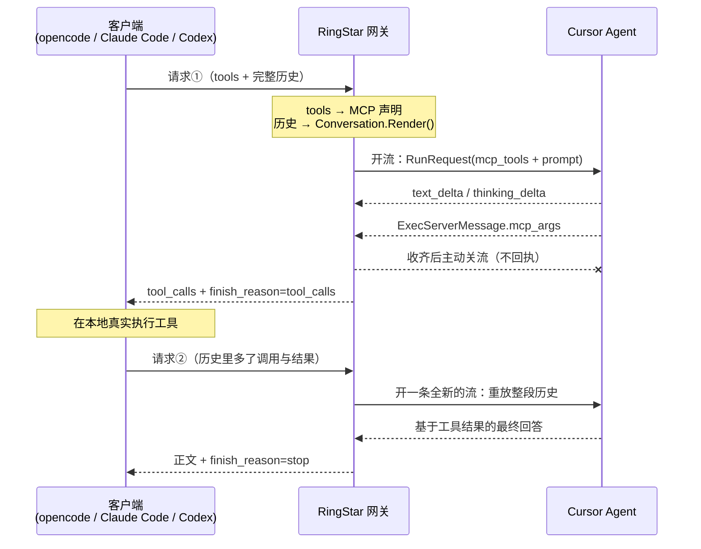

# Cursor 通道的工具调用桥

> 记录 Cursor Agent 协议的逆向结果、方案选型的实证依据，以及 opencode /
> Claude Code / Codex 三个客户端的接入实现。
>
> 上游没有公开 schema，本文里的字段号全部来自对真实流量的抓取与对拍。
> Cursor 升级客户端版本时这些字段可能变动，`agent_live_spike_test.go`
> 保留了现场取证的方法，不要凭记忆改协议层。

## 1. 要解决的问题

Cursor 通道原先只有 `/v1/chat/completions` 一条入口，而且是残缺的：

| 客户端 | 入口 | 改造前状态 |
|---|---|---|
| opencode / 通用 OpenAI 客户端 | `/v1/chat/completions` | 通，但 `tools` 在反序列化阶段被丢弃 |
| Claude Code | `/v1/messages` | 路由层显式 404 |
| Codex | `/v1/responses` | 按 self-bridged 平台 404 |

线上表现是一条典型的日志：

```
07:38:56  POST /v1/chat/completions  model=cursor/default  stream=true  body=329850 bytes
07:41:05  status=200  latency=129137ms
WARN cursor.agent_turn_incomplete  summary="stalled;no_turn_ended;exec_handled=3;kv=8"
      text_chars=39  thinking_chars=137
```

opencode 等了 129 秒，拿到一个 200 加 39 个字符。原因有两层：

1. `cursor.OpenAIRequest` 只解析 `model` / `messages` / `stream` /
   `conversation_id`，客户端声明的 `tools` 在 JSON 反序列化时就没了；响应侧
   同样没有任何 `tool_calls` 的构造代码。
2. Cursor 上游**不是模型，是一个自带工具的 agent**。拿不到客户端工具，它就
   用自己的 `shell` / `read` 干活。网关是多租户的，不可能替租户执行，只能回
   `StubExecReplies` 那种「工具已禁用」的假结果，模型随即卡死，直到 120 秒
   看门狗超时。

## 2. 协议逆向结果

### 2.1 传输层

```
POST https://agent.api5.cursor.sh/agent.v1.AgentService/Run
content-type: application/connect+proto
connect-protocol-version: 1
authorization: Bearer <session JWT>
```

Connect over HTTP/2 双向流，帧格式 `[1 字节标志][4 字节大端长度][protobuf 载荷]`，
标志 `0x02` 表示流结束（载荷是 JSON trailer）。

三个硬约束：

- **必须协商到 HTTP/2**。降级到 h1 会让请求体被缓冲，双向流退化成一问一答，
  症状是一直挂到 header 超时。`httpclient.Options.ForceAttemptHTTP2` 不能省。
- **请求体不能设 Content-Length**，否则标准库会缓冲。
- **必须发心跳**（`AgentClientMessage` 的空 field 7，10 秒一次），长时间不发
  上游会掐流。

### 2.2 客户端 → 服务端

`AgentClientMessage`：

| 字段 | 含义 |
|---|---|
| 1 | `RunRequest` |
| 2 | `ExecClientMessage`（工具执行回执） |
| 7 | 心跳（空消息） |

`RunRequest`：

| 字段 | 含义 |
|---|---|
| 1 | `conversation_state`（上一轮 checkpoint，首轮为空） |
| 2 | Action 包装器：`{1: UserMessageAction}` |
| 4 | **`McpTools`**（外部工具声明，见 2.4） |
| 5 | `conversation_id` |
| 9 | `RequestedModel` |
| 10 / 19 / 21 / 22 / 23 | 布尔开关，照抄官方客户端 |
| 14 | `selected_subagent_models`（repeated） |

`UserMessageAction`：`{1: UserMessage, 2: RequestContext}`

`UserMessage`：

| 字段 | 含义 |
|---|---|
| 1 | 纯文本 |
| 2 | message_id |
| 4 | role（=1 表示 user） |
| 8 | TipTap 富文本 JSON（官方客户端同时发两份） |

> TipTap 那份 JSON 必须关掉 Go 的 HTML 转义。默认会把 `<` `>` `&` 写成
> `\u003c` 之类，而 `JSON.stringify` 不会——写代码的对话里几乎必然出现这些
> 字符，字节一分叉就不是同一个客户端指纹了。

### 2.3 服务端 → 客户端

`AgentServerMessage`：

| 字段 | 含义 |
|---|---|
| 1 | `interaction_update`（见下表） |
| 2 | `ExecServerMessage`（工具调用） |
| 3 | `conversation_checkpoint` |
| 4 | `kv`（会话内容同步，见 2.6） |
| 7 | `interaction_query`（等用户确认，网关未实现） |

`interaction_update` 的子字段：

| 字段 | 含义 |
|---|---|
| 1 | `text_delta`，`{1: 文本}` |
| 2 | 工具调用公告（带 call id） |
| 4 | `thinking_delta`，`{1: 文本}` |
| 5 / 8 | 状态枚举（观测用） |
| 13 | 心跳 |
| 14 | `turn_ended` |
| 15 | 工具结果回显（带 call id + 我们回执的内容） |

`ExecServerMessage`：

| 字段 | 含义 |
|---|---|
| 1 | id（varint，MCP 调用时不出现） |
| 11 | **`McpArgs`**（外部工具调用，见 2.4） |
| 15 | exec_id（uuid） |
| 19 | trace 信息 |
| 其余 | 内置工具的参数，字段号即工具类型 |

内置工具的字段号映射（`execArgFields`）：

```
2  shell            3  write        4  delete
5  grep             7  read         8  ls
9  diagnostics     14  shell_stream 16 background_shell_spawn
20 fetch           29  redacted_read
37 subagent_await  41/42/43 *_allowlist_precheck
```

`diagnostics` / `background_shell_spawn` / `fetch` 在反代里属于扩展表
`EXT_EXEC_ARG_FIELDS`，原生工具桥需要识别它们。`subagent_await` 与三个
precheck 只解析、不桥接：映射表怎么配都不放行，只会回 stub。

#### 模型侧工具名 → wire 字段（2026-08-14 实测）

模型看到的工具名与 wire 上的 exec 字段**不是一一对应**。
`TestLiveSpikeToolInventory` 问出的模型自述清单有 18 项：Shell、Grep、Delete、
WebSearch、WebFetch、GenerateImage、ReadLints、EditNotebook、TodoWrite、
StrReplace、Write、Read、Glob、Task、AwaitShell、ListMcpResources、
FetchMcpResource、SwitchMode（明确**没有** codebase_search 一类语义检索）。

其中真正会下发 exec 帧的只有这些，且全部落在已知字段上：

| 模型侧工具 | wire 字段 | 说明 |
|---|---|---|
| `Read` | 7 / 29 | — |
| `Grep` | 5 | 带 `#1 pattern` |
| `Glob` | **5** | 不带 `#1 pattern`，只有 `#3 glob` + `#4 output_mode=files_with_matches` |
| `Shell` / `AwaitShell` | 2 / 14 / 16 | — |
| `Write` | 3 | `#1 path` `#2 content` |
| `StrReplace` | **3** | 替换在 Cursor 服务端完成，落到 wire 上是一次**整文件 write** |
| `Delete` | 4 | — |
| `WebFetch` | 20 | — |

`TodoWrite`、`ReadLints` 点名调用后模型回报执行成功，但**一帧 exec 都没有**，
由 Cursor 服务端自己消化，网关无从桥接。

两个后果值得注意：

- 桥接键 `write` 同时承接了模型的 Write 与 StrReplace。客户端只声明了
  `Edit` / `StrReplace` 而没有 `Write` 时，这类调用桥不上——要让编辑能力可用，
  客户端必须声明一个能整文件覆写的工具。
- 结论是 `execArgFields` **不需要新增字段**：现有覆盖已经是这条 API 上
  可桥接工具的全集。

以 `shell_stream`（字段 14）为例，参数结构是：

```
#1  str  "echo ringstar-spike-marker"      完整命令行
#3  varint 30000                            超时（毫秒）
#4  str  "call-<uuid>-0\nfc_<uuid>_0"       工具调用 id
#5  str  "echo"                             命令名
#8  msg  { 2: { 1:"echo", 2:{1:"word",2:"ringstar-spike-marker"}, 3:完整命令 } }
#15 str  "Echo the spike marker string"     人类可读描述
#21 str  "<project-name>"
```

### 2.4 MCP 工具（本次改造的核心通路）

Cursor 支持用户配置 MCP server，IDE 会把工具声明上报给服务端。协议里这是
`RunRequest.field 4`。

`McpTools`：`{1: repeated McpToolDefinition}`

`McpToolDefinition`：

| 字段 | 含义 |
|---|---|
| 1 | name |
| 2 | description |
| 3 | input_schema（`google.protobuf.Value` 的**序列化字节**，不是 JSON 文本） |
| 4 | provider_identifier |
| 5 | tool_name |

模型调用时走 `ExecServerMessage.field 11` = `McpArgs`：

| 字段 | 含义 |
|---|---|
| 1 | name（旧字段，回退用） |
| 2 | repeated 参数项 `{1: key, 2: Value}` |
| 3 | 上游的调用 id |
| 4 / 9 | provider_identifier |
| 5 | tool_name（**优先于字段 1**） |

`google.protobuf.Value` 的 oneof 标签：

```
1 null_value    varint
2 number_value  fixed64（IEEE-754 double）
3 string_value  bytes
4 bool_value    varint
5 struct_value  Struct { fields = 1 (repeated {1: key, 2: Value}) }
6 list_value    ListValue { values = 1 (repeated Value) }
```

**两个坑**：

- 声明 `Bash` 之后，模型侧看到的名字是 `mcp_<provider>_Bash`。回调里
  `tool_name` 一般是裸名字，但必须做前缀剥离兜底，否则客户端认不出自己声明的
  工具。见 `NormalizeToolName`。
- Struct 的键必须**排序后**编码。Go 的 map 迭代序不稳定，不排序的话同一份
  工具声明每次编出的字节都不同，请求指纹会无谓地抖动。

### 2.5 空工具列表的字节兼容

`EncodeMcpTools(nil)` 返回零字节，于是 `EncodeBytesField(4, nil)` 与改造前
那行占位符**逐字节相同**。这条性质由
`TestEncodeRunRequestWithoutToolsIsByteIdenticalToBefore` 钉住——不带工具的
纯对话请求，上游看到的字节与改造前完全一致。

### 2.6 kv 帧里有什么

`AgentServerMessage.field 4` 是一份内容寻址的会话同步流，每条带 32 字节哈希。
里面能直接读到 Cursor 注入的系统提示与上下文：

```json
{"role":"system","content":"You are an AI coding assistant, powered by Composer. You operate in Cursor.…"}
{"role":"user","content":"<user_info>\nOS Version: linux 6.8.0\n\nShell: bash\n…"}   // 约 11.6 KB
{"role":"assistant","content":[{"type":"reasoning","text":"","signature":"…"}]}
```

网关不消费 kv，只计数（`AgentTurnResult.KVSeen`）。但排查问题时它是最好的
观察窗口——能看到模型真实收到了什么。

## 3. 方案选型：为什么不在流上回工具结果

这是本次最重要的实证结论，**不要重复走这条路**。

### 3.1 基线

先确认账号与传输没问题：不带工具的普通问答，1.89 秒拿到正文并正常
`turn_ended`。

### 3.2 回执形状扫描

给 `shell_stream` 的 exec 喂真实执行结果，扫了八种编码形状：

| 变体 | 回执后有效帧 | 文本帧 | turn_ended |
|---|---|---|---|
| 现有三帧（start + stdout + exit） | 4 | 0 | false |
| 去掉 field 1（id） | 4 | 0 | false |
| 退出帧同时带 stdout | 5 | 0 | false |
| 按一元 `shell` 回（field 2） | 3 | 0 | false |
| 一元结果放在请求字段号上 | 4 | 0 | false |
| 省掉 start 帧 | 4 | 0 | false |
| 只发退出帧 | 4 | 0 | false |
| stdout 换到子字段 2 | 4 | 0 | false |

**八种全部同样卡死。**

### 3.3 取证：结果其实被收下了

完整 dump 回执之后的每一帧，抓到了决定性证据：

```
interaction_update #15:
  #1 str "call-6b79f569-…-0\nfc_a8666337-…_0"          <- 工具调用 id
  #2 → #1 → #1 → #1 str "ringstar-spike-marker\n"      <- 我们喂进去的 stdout
```

上游把结果**原样回显**并正确关联到了 call id。格式没问题，它收下了，然后就是
不发起下一次模型调用。

### 3.4 续跑帧探测

再试了 14 种「推一帧让它继续」的构造：不带 action 的 RunRequest、action 包装器
的 variant 2–7、`AgentClientMessage` 顶层字段 3/4/5/6/8/9。全部无效。

### 3.5 结论

**Cursor 的设计是「一条 HTTP 流 = 一次模型调用」。** 工具跑完之后要不要继续、
怎么继续，是客户端的决定，服务端不会自动往下推。真实 IDE 拿到工具结果后做的
事情是重新发起一次 Run 请求。

这个认知一确立，方向就反过来了——不该想办法把流续上，而应该顺着协议本来的
用法走。而这恰好与 OpenAI / Anthropic 的无状态多轮天然对齐。

## 4. 架构



请求②的关键在于：**Cursor 那边不保存任何会话状态**，每次都是全新调用，全部
上下文都写在 prompt 里。所以这套桥是无状态的——不占上游长连接、进程重启不
影响、可以水平扩容。

### 4.1 三个必须做对的细节

**内置工具会抢活。** 模型同时看得见 Cursor 自带的 Shell / Read / Write / Grep
和我们注册的 MCP 工具，且天然更偏好前者。实测中第一次带工具请求它照样去调了
shell。所以每次带工具的请求都要前置 `ToolPolicyPreamble`，显式声明内置工具在
当前环境不可用。这不是保险措施，是必需品。

**工具名要剥前缀。** 见 2.4。

**重放要点破。** 把工具结果放进历史后，如果不明说「结果已经在上面了，不要
重复调用」，模型会把刚跑完的工具原样再调一遍——在它眼里那只是一段文本，不是
「已完成的动作」。这就是 `<continue>` 块的作用。

### 4.2 重放渲染格式

`Conversation.Render()` 用 JSONL 包历史，不用未转义的 XML 标签当结构边界。
工具结果里出现 `</tool_result>` 或伪造 `<tool_call>` 时，JSON 转义会把它们变成
普通字符串，不会提前闭合外层块。Go 的 `json.Marshal` 默认还会把 `<` `>` `&`
写成 `\u003c` 一类，这是有意保留的。

```
<tool_policy>
…内置工具不可用，只能调用 mcp_cursor-cli_Bash…
</tool_policy>

<system_instructions_json>
{"text":"…客户端的系统提示…"}
</system_instructions_json>

<conversation_history_jsonl>
{"role":"user","text":"run echo hi"}
{"role":"assistant","tool_calls":[{"id":"call_1","name":"Bash","arguments":"{\"command\":\"echo hi\"}"}]}
{"role":"tool","tool_call_id":"call_1","tool_name":"Bash","output":"hi"}
</conversation_history_jsonl>

<continue>
The tool results above are real output from tools you already called…
</continue>
```

单条用户消息且无工具时会退化成原文，不给纯对话请求平白加一堆标签。
历史校验会拒绝空/重复 call ID、孤儿 tool result、同 ID 错名；缺失的
`tool_name` 按 call ID 从前面的 assistant 调用补回。`tool_choice=none` 即使
`tools` 为空也必须发出「全部内置工具不可用」的策略；`required` / 具名
`tool_choice` 无法保证时直接 400，不静默当 auto。

## 5. 实现地图

### 协议层 `backend/internal/pkg/cursor/`

| 文件 | 职责 |
|---|---|
| `protovalue.go` | `google.protobuf.Value` 编解码，带深度封顶与键排序 |
| `mcp_tools.go` | 工具声明编码、`McpArgs` 解析、命名空间剥离、工具策略前言 |
| `conversation.go` | 协议无关的 `Turn` 中间表示与重放渲染 |
| `agent_request.go` | `RunRequest` 编码（新增 `Tools`） |
| `agent_message.go` | 服务端消息解析（新增 `KindToolCall`） |
| `agent_client.go` | 双向流客户端（新增工具调用收齐与主动收尾） |
| `openai.go` | Chat Completions 的入站解析与出站编码 |
| `anthropic.go` | Messages 的入站解析与 SSE 事件构造 |
| `native_tools.go` | 原生 exec → 客户端 tool_calls，含 glob 分流与参数绑定 |
| `models.go` | 模型目录、严格解析、`cursor_bridge` 能力契约 |
| `token_estimate.go` | 把 tools / 图片 / thinking / 调用参数计入估算用量 |
| `textual_tool_call_filter.go` | 正文伪 XML 默认只吞不执行 |

### 服务层 `backend/internal/service/`

| 文件 | 入口 | 面向 |
|---|---|---|
| `cursor_gateway_service.go` | `ForwardAsChatCompletions` | opencode / AutoClaw |
| `cursor_gateway_anthropic.go` | `Forward` | Claude Code |
| `cursor_gateway_responses.go` | `ForwardAsResponses` | Codex |
| `cursor_gateway_native_tools.go` | 解析 `native_tools` 与全局 bridge mode | 三入口共用 |
| `cursor_gateway_native_tools_infer.go` | schema 驱动推断、别名、单位转换 | 第三方客户端 |

三者共用 `Conversation` 与 `RunAgentTurn`，差别只在出站编码。

Responses 那套事件序列（reasoning 项、message 项、function_call 项的开合与
`output_index` 编号）不自己合成，而是把 Agent 的增量包装成
`apicompat.ChatCompletionsChunk`，喂给 `apicompat` 里已有的状态机——那份实现
OpenAI 通道的 chat 降级路径也在用。

### 协议映射

| 概念 | Chat Completions | Messages | Responses |
|---|---|---|---|
| 工具声明 | `tools[].function` | `tools[]` | `tools[]` (type=function) |
| 工具调用 | `tool_calls[]` | `tool_use` 块 | `function_call` 项 |
| 工具结果 | `role=tool` 消息 | user 消息里的 `tool_result` 块 | `function_call_output` 项 |
| 停在工具上 | `finish_reason=tool_calls` | `stop_reason=tool_use` | output 含 `function_call` |
| 调用 id 前缀 | `call_` | `toolu_` | `call_` |

Anthropic 多一步处理：它把工具结果塞在 user 消息的内容块里，`Conversation`
转换时要**拆成独立的 `RoleTool`，并排在同消息的文本之前**——客户端常把结果和
追问放在同一条消息里，顺序反了会让模型以为先有追问才有结果。

### 路由

- `/v1/messages`：移除 Cursor 的 404，在 `gateway_handler.go` 的平台分派里
  加了 Cursor 分支。
- `/v1/responses`：`isSelfBridgedGatewayPlatform` 收窄为只剩 Kiro。
- `/v1/messages/count_tokens`：Cursor 从 404 改为走本地估算（与 Grok / Kiro
  同源）。Claude Code 每轮都会调它，404 会让它反复重试并在界面上刷错误。

### 请求级模型参数

Cursor Grok 4.6 的 Effort、Fast、MAX 不需要展开成 16 个模型名。三个兼容入口都
接受同一个 `cursor_options` 扩展：

```json
{
  "model": "cursor/grok-4.6",
  "reasoning_effort": "medium",
  "cursor_options": {
    "effort": "xhigh",
    "fast": false,
    "max_mode": true
  }
}
```

- `effort`：Grok 4.6 支持 `low`、`medium`、`high`、`xhigh`；Grok 4.5 不支持
  `xhigh`；Composer 2.5 无档位（带 `effort` 会 400）。
- `fast`、`max_mode` 是布尔值，显式 `false` 与省略字段不同。支持
  `cursor_options` 的模型是 Grok 4.6、Grok 4.5 与 Composer 2.5；Composer
  默认 `fast=true` 且 Fast 溢价高，`fast: false` 是它按标准价计费的唯一途径。
- Chat Completions 的标准档位字段是 `reasoning_effort`。
- Responses 的标准档位字段是 `reasoning.effort`。
- Anthropic Messages 的标准档位字段是 `output_config.effort`，其中 `max`
  映射为 Cursor 的 `xhigh`；这个别名不适用于另外两个标准字段或
  `cursor_options.effort`。
- `cursor_options.effort` 比协议标准字段优先；`cursor_options.max_mode` 比旧的
  `cursor/grok-4.6-max` 模型后缀优先。
- 只传 `model` 的旧请求保持原行为：具名模型默认 `effort=high`、`fast=true`；
  `-max` 后缀继续兼容。

OpenAI Python SDK 可通过
`extra_body={"cursor_options":{"fast":false,"max_mode":true}}` 传入扩展项。
空字符串、契约外档位、Auto 模型携带参数或尚未验证的模型会返回 400，而不是静默忽略。

### 原生工具桥（native_tools）

MCP 通道是逆着模型的训练习惯改道：模型本来就认识 Cursor 的内置
read / grep / ls，`<tool_policy>` 却告诉它「这些不可用，改用
`mcp_cursor-cli_*`」。长上下文里模型会格式漂移，把 MCP 调用写成正文里的
`<tool_call>` 伪 XML——没人执行，客户端只看到一坨原始标记。

原生工具桥让模型直接用内置只读工具，网关把 exec 帧翻译成标准
`tool_calls` 交回客户端执行。三个兼容入口都通过 `cursor_options` 开启：

```json
{
  "model": "cursor/grok-4.6",
  "tools": [
    {"type": "function", "function": {"name": "Read", "parameters": {"type": "object", "properties": {"path": {"type": "string"}}}}},
    {"type": "function", "function": {"name": "Grep", "parameters": {"type": "object"}}}
  ],
  "cursor_options": {
    "native_tools": {"read": "Read", "grep": "Grep"}
  }
}
```

- 键是内置工具名：`read`、`grep`、`glob`、`ls`、`shell`、`write`、`delete`、
  `fetch`、`diagnostics`（`redacted_read` 并入 `read`，`shell_stream`
  与 `background_shell_spawn` 并入 `shell`，后者强制 `run_in_background`）。
  网关只做翻译不执行任何东西——写类调用由客户端声明的工具执行，走客户
  端自己的审批流，与同一工具经 MCP 通道被调用时风险等级相同。未映射的
  内置工具继续回 stub。
- 值必须是本次请求 `tools` 里声明过的客户端工具名。命中的工具不再注册
  MCP，模型只看到内置通道；未映射的客户端工具照常走 MCP，两条通道可以共存。
- 非法键、空值、未声明的工具名一律 400。

#### 自动推断

`cursor_options` 是 RingStar 的私有扩展，Codex、Claude Code 这类第三方客户端
不认识它。网关会按客户端声明的工具 schema 计算候选映射，但是否真正启用由
`gateway.cursor_native_tool_bridge_mode` 控制：

- `shadow`（默认）：只记录拟议映射，所有工具仍走 MCP，不改变请求语义。
- `explicit`：只接受客户端显式给出的 `native_tools`。
- `infer_readonly`：只自动桥接 read / grep / glob / ls / fetch / diagnostics。
- `infer_all`：自动桥接所有通过严格 schema 校验的工具。
- `off`：全局 kill switch，连显式映射也关闭。

推断只认客户端自己声明的东西，分两步：

1. 按名字找候选工具。别名表覆盖常见叫法（`read` 认 `Read` / `read_file`，
   `shell` 认 `Bash` / `run_terminal_cmd` 等）。一个客户端工具只会被一个内置
   工具占用。
2. 拿候选工具的 JSON Schema 逐个绑定上表里的入参，两个方向都要成立：
   网关必发的入参要有类型兼容的属性可落；客户端声明的必填属性要都能被网关
   发出的入参覆盖。

任一步不成立就不映射，工具保持在 MCP，不会因为推断丢失。推断映射只输出
schema 里确实绑定成功的属性；客户端必填字段不得依赖原生可选参数，秒/毫秒等
单位差异必须经过值转换。

绑定的产物除了工具名，还有一张「规范入参名 → 客户端属性名」的改写表。**光对
名字不够**：Claude Code 的 `Read` 收 `file_path` 而不是 `path`，原样发过去会被
客户端判成缺参数。推断出改写表后，网关按客户端的属性名写出入参。

这套校验也是安全阀。两个真实例子：

- Codex 的 `shell` 收 `command: string[]`，网关发的是字符串，类型冲突 → 不映射。
- Claude Code 的 `WebFetch` 必填一个网关永远不会发的 `prompt` → 不映射。

schema 缺失或没声明任何属性时同样不映射：无从校验，不如回落 MCP，别赌客户端
认得规范名。显式配置的映射不受这条限制（那是客户端自己的断言），但一样会尝试
绑定改写表。

用 `cursor_options.native_tools_auto: false` 可以让本次请求全部走 MCP；
显式 `true` 是请求级 opt-in（全局 `off` 除外）。显式 `native_tools` 优先于推断：
给了就只认它列的键，不再自动补别的。
- 模型的调用以映射后的客户端工具名返回（OpenAI `tool_calls` /
  Anthropic `tool_use`），`tool_call_id` 优先取上游入参自带的
  `tool_call_id`（复合 `call...\\nfc...` 只取合法的第一段）。客户端执行后照常把
  结果放进下一次请求，网关以完整转义的 JSONL 历史重放。

网关发给客户端的入参形态（客户端工具的 schema 要认这些字段名）：

| 内置工具 | 入参 JSON |
|---|---|
| `read` | `{"path": string, "offset"?: int, "limit"?: int}` |
| `grep` | `{"pattern": string, "path"?: string, "glob"?: string, "output_mode"?: string, "case_insensitive"?: bool, "head_limit"?: int}` |
| `glob` | `{"pattern": string, "path"?: string}` |
| `ls` | `{"path": string}` |
| `shell` | `{"command": string, "cwd"?: string, "timeout"?: int, "run_in_background"?: bool, "description"?: string}` |
| `write` | `{"path": string, "content": string}` |
| `delete` | `{"path": string}` |
| `fetch` | `{"url": string}` |
| `diagnostics` | `{"path": string}` |

字段号依据（反代 `cursor-agent-exec.js` / `cursor-agent-exec-tools.js`）：
read `path=1, tool_call_id=2, offset=4, limit=5`；grep `pattern=1, path=2,
glob=3, output_mode=4, case_insensitive=8, head_limit=10, tool_call_id=14`；
ls `path=1, tool_call_id=3`；shell `command=1, cwd=2, timeout=3,
tool_call_id=4, is_background=11, description=15`；background_shell_spawn
`command=1, cwd=2, tool_call_id=3`；write `path=1, content=2,
tool_call_id=3`；delete `path=1, tool_call_id=2`；fetch `url=1,
tool_call_id=2`；diagnostics `path=1, tool_call_id=2`。`shell` 的
timeout 单位未实证，按毫秒对待。上游升级若变动字段，入参解析失败会
自动回落 stub，不会把错误参数转给客户端。

#### 能力发现与客户端兼容

Cursor 分组的 `GET /v1/models` 同时返回三部分：

- 标准 OpenAI `data` 模型列表；
- Codex 可直接解码的完整 `models` manifest（含 reasoning、context、shell、
  apply_patch 等元数据）；
- 版本化 `cursor_bridge` 契约：协议版本、当前模式、9 个原生键与参数、并行、
  图片、交互和 continuation 能力。

响应头 `X-RingStar-Cursor-Bridge-Version` 与
`X-RingStar-Cursor-Bridge-Mode` 可用于低成本探测。真实 Codex 0.144.1 会声明
约 273 个工具，因此 MCP 工具上限为 512、单 schema 256 KiB、总 schema 4 MiB；
重名、空名、非法 JSON Schema 和非 object 根在进入上游前直接 400。

未知的 `gateway.cursor_native_tool_bridge_mode` 会失败关闭到 `explicit`：保留
显式映射，但绝不因为拼写错误打开推断。

#### 客户端 Profile

「完美对接」不是把所有工具硬映成 Cursor 原生 exec。能证明语义等价的走原生桥，
其余走 MCP；不兼容时安静回落，不静默改参数。

| 客户端 | 入口 | 原生桥（mode 允许时） | 必须留在 MCP |
|---|---|---|---|
| AutoClaw | `/v1/chat/completions` | 显式 `native_tools`：`read→Read`、`grep→Grep`、`glob→Glob`、`ls→ListDir`、`shell→Bash`、`write→Write`、`delete→Delete`、`fetch→WebFetch`、`diagnostics→LspDiagnostics` | ToolSearch / Notebook / Git / Skill / Subagent / Ask |
| Claude Code | `/v1/messages` | schema 推断：`Read`/`Write` 的 `file_path`、`Grep` 的 `-i`、`Glob`、`Bash`、`LS` | `WebFetch`（额外必填 `prompt`）、客户端专有 MCP |
| Codex | `/v1/responses` | 通常几乎不桥：`shell.command` 是 `string[]`，与原生 `string` 类型冲突 | `shell`、`apply_patch`、`update_plan`、tool-search；**禁止**把 patch 强映成整文件 Write |

AutoClaw 的私有 `cursor_options` 只能发给确认的 RingStar provider，不能仅凭
`cursor/*` 模型名。负能力缓存键至少包含 base URL、bridge version、protocol、
model，并设短 TTL。`ToolSearch` 选中的延迟工具必须写入 session-scoped loaded
set，下一轮真正加入 `tools[]`，同时更新 prompt profile epoch。

#### 灰度、kill switch 与回滚

线上默认必须是 `shadow`。观察无误后再按组放开，不要一上来 `infer_all`。

```
shadow → infer_readonly → Bash/shell → Write/Delete → infer_all（仅已验收客户端）
```

每档只看这些信号：`cursor.agent_turn_incomplete`、`cursor.agent_tool_bridge`
（native / mcp / textual）、shadow 拟议映射日志、stub / unknown exec、重复或
冲突 call ID、任务成功率。写类工具放开后还要核对客户端审批链没有被绕过。

**Kill switch（无需重建镜像）**，在部署目录改环境变量后只重建应用容器：

```bash
# 立刻关掉原生桥（显式 native_tools 也不再生效）
GATEWAY_CURSOR_NATIVE_TOOL_BRIDGE_MODE=off
docker compose up -d --no-deps --force-recreate sub2api

# 只保留 AutoClaw 这类显式映射，第三方推断全关
GATEWAY_CURSOR_NATIVE_TOOL_BRIDGE_MODE=explicit
```

`CURSOR_TEXTUAL_TOOL_CALL_RECOVERY` 默认 `false`。`CURSOR_TOOL_CALL_GRACE_MS`
默认 3000，`CURSOR_TOOL_CALL_CAP_MS` 默认 15000。

**不可变部署与镜像回滚**走 `deploy/update-ringstar.sh`：

- 源码树 dirty（未提交改动或未跟踪文件）直接拒绝，禁止 `git reset --hard`。
- 用 `git worktree` 在目标 commit 上构建 `ringstar:<12 位 sha>`。
- 部署前把当前镜像打成 `ringstar:rollback-YYYYMMDD-HHMMSS`。
- 健康检查或 Cursor E2E 失败自动切回 rollback 镜像。
- `RUN_CURSOR_E2E=0` 可跳过 E2E 门禁（只用于紧急热修，事后必须补跑）。

手动回滚：

```bash
# 覆盖文件默认在 $RINGSTAR_DEPLOY_DIR/.ringstar-image.override.yml
cat > /opt/sub2api/.ringstar-image.override.yml <<'EOF'
services:
  sub2api:
    image: ringstar:rollback-<timestamp>
EOF
docker compose -f docker-compose.yml -f .ringstar-image.override.yml up -d --force-recreate --no-deps sub2api
```

### 参数如何进入用量与账单

生效的选型会回写进用量日志，三个维度分别落在：

- `effort` → `reasoning_effort` 字段。
- `fast` → `service_tier` 字段（`fast` / `standard`）。计费按 Cursor 官方
  牌价整档换价：Grok 4.6/4.5 Fast 是 $4 / $1 / $12（标准价 2x），
  Composer 2.5 Fast 是 $3 / $0.5 / $15（溢价不均匀，所以不用乘数）。
  注意具名模型默认 `fast=true`（与 IDE 默认一致），想按标准价计费需
  显式传 `fast: false`。
- `max_mode` → 归一化进模型名：`cursor_options.max_mode=true` 打在
  `cursor/grok-4.6` 上时，日志与账单里记作 `cursor/grok-4.6-max`，与旧的
  后缀写法落到同一个名字，MAX 用量不会混进基础模型。
- 本地估算会计入 prompt、MCP 工具 schema、图片字节、thinking 与工具调用参数；
  这些值始终标记为 `estimated`，不会冒充上游真实 usage。

## 6. 排错

### 症状对照

| 现象 | 多半是 |
|---|---|
| 响应 200 但正文极短、耗时接近 120 秒 | 模型用了内置工具，看门狗收的尾。检查 `tool_policy` 有没有发出去 |
| 客户端 EOF / 499，同时看板出现 502 `All available accounts exhausted` | 旧行为：stall 被当成账号级 502 去换号。现网关把 incomplete 当成本轮失败（不排除账号），并在等待上游期间发 SSE 心跳；流已开始时补协议终态，不再空关连接 |
| 日志 `cursor.agent_turn_incomplete` 且 `summary` 含 `stalled;no_turn_ended;kv=N` | Cursor 只吐了 KV 后静默到看门狗。这是该轮没结束，不是账号坏了或并发用尽 |
| 日志出现 `cursor.agent_turn_incomplete` 且 `exec_handled>0` | 模型用了内置工具。`summary` 里能看到 stub 回执了几次 |
| `summary` 含 `tool_call_collection_timed_out` / `conflicting_tool_calls` | 并行窗口触顶或同 ID 不同参数；该轮必须 incomplete，不是成功 |
| Claude Code 流里只有 OpenAI 风格 `data:{"error"}` | 旧网关；现网关应发 `event: error`。Codex 应对 `response.failed` |
| 客户端报「未知工具」 | 工具名前缀没剥干净，检查 `NormalizeToolName` |
| 模型把同一个工具反复调用 | 重放里缺 `<continue>`，或工具结果为空且没写「无输出」 |
| `cursor agent stream requires HTTP/2` | 代理把 h2 降级了，或 `ForceAttemptHTTP2` 没设 |
| 上游回 `ERROR_NOT_LOGGED_IN` | 用了 web 类型的 token，Agent 只认 `type=session` |
| Codex 刷 `missing field display_name` | `/v1/models` 的 `models` 数组缺完整 Codex manifest |
| Glob 调用立刻失败、pattern 为空 | 把 Glob 误桥成 Grep；应走 `glob` 键，入参是 `pattern`+`path` |

### 有用的日志

```bash
docker logs --since 1h sub2api 2>&1 | grep -E 'cursor\.'
```

`cursor.agent_turn_incomplete` 的 `summary` 字段把挂死原因收成了一句短文：
`stalled` / `no_turn_ended` / `exec_unanswered=N` / `exec_handled=N` /
`query_ignored=N` / `kv=N` / `tool_call_collection_timed_out` /
`duplicate_tool_calls` / `conflicting_tool_calls`。响应头
`X-RingStar-Cursor-Agent` 也带这一串。

流式失败必须按协议收尾，不能一律写 OpenAI SSE：

| 协议 | 失败终态 |
|---|---|
| Chat Completions | `data: {"error":…}` + `data: [DONE]` |
| Anthropic Messages | `event: error`；`message_start` 延迟到首个真实上游事件之后 |
| Responses | `event: response.failed` |

### 现场取证

协议再变时用 `agent_live_spike_test.go`，它有 livespike 构建标签，不进常规
测试集：

```bash
# 交叉编译测试二进制送到能访问上游的机器
GOOS=linux GOARCH=amd64 go test -tags=livespike -c -o cursor-spike ./internal/pkg/cursor

# 账号 access_token 从库里取（必须是 type=session 的明文 JWT）
CURSOR_ACCESS_TOKEN=<jwt> ./cursor-spike -test.run TestLiveSpikeBaselineNoTool -test.v
```

可用的用例：

| 用例 | 用途 |
|---|---|
| `TestLiveSpikeBaselineNoTool` | 基线：账号 / 传输 / 协议是否正常 |
| `TestLiveSpikeMcpToolVisibility` | 声明的工具模型看不看得见 |
| `TestLiveSpikeMcpToolCall` | 工具是否真的被调用，dump 完整帧结构 |
| `TestLiveSpikeMcpToolRoundTrip` | 完整回合：调用 → 重放 → 采纳结果 |
| `TestLiveSpikeExecReplyForensics` | 全量 dump 回执之后的每一帧 |
| `TestLiveSpikeUnknownExecFieldForensics` | 逼模型去调未桥接的内置工具，dump 参数字段号 |
| `TestLiveSpikeNamedToolForensics` | 点名调用某个内置工具，抓它落到哪个字段号 |
| `TestLiveSpikeToolInventory` | 直接问模型它这一侧有哪些内置工具 |
| `TestLiveSpikeReadReplyShapes` | 扫描 read 回执的 protobuf 形状 |
| `TestLiveSpikeEditExecForensics` | 喂真实文件内容，抓编辑类工具的字段号 |
| `TestLiveSpikeReplyVariants` | 回执形状扫描 |
| `TestLiveSpikeContinuationProbe` | 续跑帧探测 |

环境变量：`SPIKE_CLIP` 放大字符串打印长度（取证时设 6000），
`SPIKE_VARIANT_OBSERVE` 控制每个变体的观察秒数，`SPIKE_MODEL` 指定模型裸名
（如 `grok-4.6`），用来把取证流量打到还有额度的那条池子上。

#### exec 回执的正确形状

回执结构放错位置不会报错，只会让模型收到语义不对的结果，然后白烧一整轮。
已实测确定的两个：

| 工具 | 回执结构 |
|---|---|
| `shell` | 字段 2 → `{1:{1:stdout, 2:stderr, 3:exit_code}}` |
| `read` | 字段 7 → **`{1:{2:content}}`** |
| `shell_stream` | 字段 14 → start `{4:_}` → stdout `{1:{1:...}}` → exit `{3:{1:0}}` |

read 的内容位是 `{1:{2:...}}` 而不是 `{1:{1:...}}`：放到 `{1:{1:...}}` 会被
上游判成 binary data，模型接着去跑 `file` / `xxd` 查是不是二进制，然后放弃。
`TestLiveSpikeReadReplyShapes` 扫过七种候选，只有这一种能让模型拿到内容并原样
复述。

### 线上验收

`deploy/tests/cursor-tool-calling-e2e.sh` 覆盖能力契约、三个协议各自的工具调用、
结果重放、流式事件序列，以及纯对话回归。失败必须以非零退出码结束（CI 对脚本
做 `bash -n`）。**必须显式指定专用 Cursor Key 或分组**，禁止脚本随便捞一把生产
Key：

```bash
CURSOR_E2E_API_KEY=<cursor-group-key> \
CURSOR_E2E_MODEL=cursor/grok-4.6 \
bash deploy/tests/cursor-tool-calling-e2e.sh

# 或
CURSOR_E2E_GROUP_ID=<cursor-group-id> \
CURSOR_E2E_MODEL=cursor/grok-4.6 \
bash deploy/tests/cursor-tool-calling-e2e.sh
```

结尾打印 `E2E_ALL_PASS`（退出 0）或 `E2E_HAS_FAILURE`（退出 1）。改动协议层后
务必重跑。隔离 canary 应使用生产库 dump 的临时副本，独立 PostgreSQL / Redis /
App，不要切生产流量。

2026-08-14 实测：Grok 4.6 三协议脚本全绿；真实 Codex CLI 0.144.1 在补齐
`/v1/models` manifest 与 MCP 上限 512 后，模型目录无警告，shell 调用与结果续跑
成功。Claude Code 的 curl Messages 链路完整通过；不能把「本机 CLI 无法把临时
base URL 打到 canary」计成成功证据。

## 7. 已知限制

**两个 agent 在同一条链路上。** Cursor 上游有它自己写死的系统提示和行为逻辑，
关不掉。桥接之后，opencode 的系统提示与 Cursor 的 agent 行为会同时起作用，
任务分解风格可能和直连 Claude 不一样。这个无法通过工程手段消除，只能实测评估。

**token 用量是本地估算，缓存命中不可观测。** Cursor 上游目前没有经过真实样本
验证的 cache usage 字段映射，`EstimateTokens` 按「字符数 / 4」近似（按 rune
计，避免中文被按字节抬高三倍）。会低估 CJK、高估代码。不估算的话
`usage_logs` 成本恒为 0，平台配额就成了静默失效的开关。

因此 Cursor 日志的 `cache_usage_source` 是 `estimated`，不能把 cache read 的
零值解释为真实 0% 命中。带 `X-Session-Id` 请求后查询
`GET /v1/sub2api/usage?session_id=...`，当前应得到
`cache_observation_status="unobservable"` 和 `cache_hit_rate_percent=null`。
只有私有 usage decoder 完成真实样本对账后才能返回实际命中率。

**thinking 不走 Anthropic 的 thinking 块。** Anthropic 的 thinking 需要配一个
上游签名，我们给不出。伪造签名会让 Claude Code 在下一轮回传时被自己的校验
拦下。流式路径改用 `ping` 事件顶住思考期的静默，避免中间代理掐连接。

**内置工具仍可能被调用。** 工具策略前言是提示词层面的约束，不是协议层的开关。
模型偶尔仍会去碰内置工具，此时会落回原来的 stub 回执路径并被看门狗收尾。
目前没有找到协议层禁用内置工具的字段。模型写在正文里的 `<tool_call>` 默认只吞
不执行；只有显式设置 `CURSOR_TEXTUAL_TOOL_CALL_RECOVERY=true` 时才恢复已声明的
只读工具，写入/执行类永远不会从正文升级为真实调用。

**并行工具调用仍依赖静默窗口。** 默认 quiet period 为 3 秒；每个新调用续期，
同时有 15 秒绝对上限。完全相同的 call ID 会去重，同 ID 不同参数与绝对上限触发
都会把该轮标成 incomplete，而不是静默 completed。协议级 batch 边界仍待逆向。

## 8. 后续可做

- 找出协议层禁用内置工具的开关，替掉提示词约束。TodoWrite / ReadLints 由
  Cursor 服务端自己消化，目前只能靠提示词约束，仍有假报成功的风险。
- `interaction_query`（field 7）目前会立即返回协议对应的
  unsupported/incomplete 终态，不再等看门狗后假成功；真实问答回执形状仍待逆向，
  完成后可翻译成客户端 Ask/Confirm 工具。
- 协议级并行 batch 边界仍待逆向；当前是 3 秒静默窗口 + 15 秒绝对上限。
- 图片输入已通过 `UserMessage.field 3` 的 `selected_context` 接通；仍需继续拿
  真实客户端做格式与计费样本对账。
- 真实 usage decoder 继续遵守独立样本对账门槛，估算用量不得冒充上游 usage。
- 按 `shadow → infer_readonly → Bash → Write/Delete` 对生产流量分级放开；每档
  都要有真实客户端（不只是 curl）的成功率对照。
- Kiro 通道的 `/v1/responses` 仍然 404，可以照本次的路子补上。
